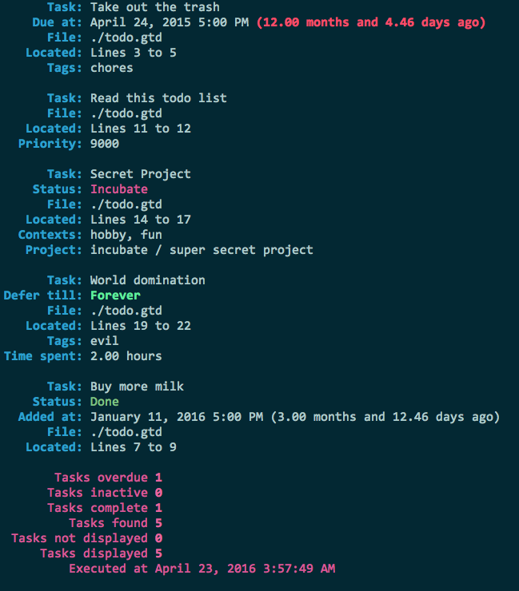

gtdtxt
======

> CLI app to parse a human-readable text file for managing GTD workflow.



```
gtdtxt v0.2.1 (semver.org)
Alberto Leal <mailforalberto@gmail.com> (github.com/dashed)
CLI app to parse a human-readable text file for managing GTD workflow

USAGE:
    gtdtxt [FLAGS] [OPTIONS] <path to gtdtxt file>

FLAGS:
    -h, --help                        Prints help information
    -F, --hide-flagged                Hide flagged tasks.
    -I, --hide-incomplete             Hide incomplete tasks.
    -n, --hide-nonproject-tasks       Hide tasks not belonging to a project.
    -o, --hide-overdue                Hide overdue tasks.
    -r, --reveal-deferred             Reveal deferred tasks.
    -d, --show-done                   Show completed tasks.
    -i, --show-incubate               Show incubated tasks.
    -f, --show-only-flagged           Show only flagged tasks.
    -z, --sort-overdue-by-priority    Sort overdue tasks by priority.
    -q, --validate                    Validate file and suppress any output.
    -V, --version                     Prints version information

OPTIONS:
    -c, --filter-by-context <filter-by-context>    Filter using given context.
    -p, --filter-by-project <filter-by-project>    Filter using given project path.
    -t, --filter-by-tag <filter-by-tag>            Filter using given tag.

ARGS:
    <path to gtdtxt file>    Path to gtdtxt file.

```


Inspired by [todotxt.com](http://todotxt.com/) and [ledger-cli.org](http://ledger-cli.org/).

## Examples

- [reference-todo.gtd](./reference-todo.gtd)
- [examples/todo.gtd](./examples/todo.gtd)


License
=======

MIT
